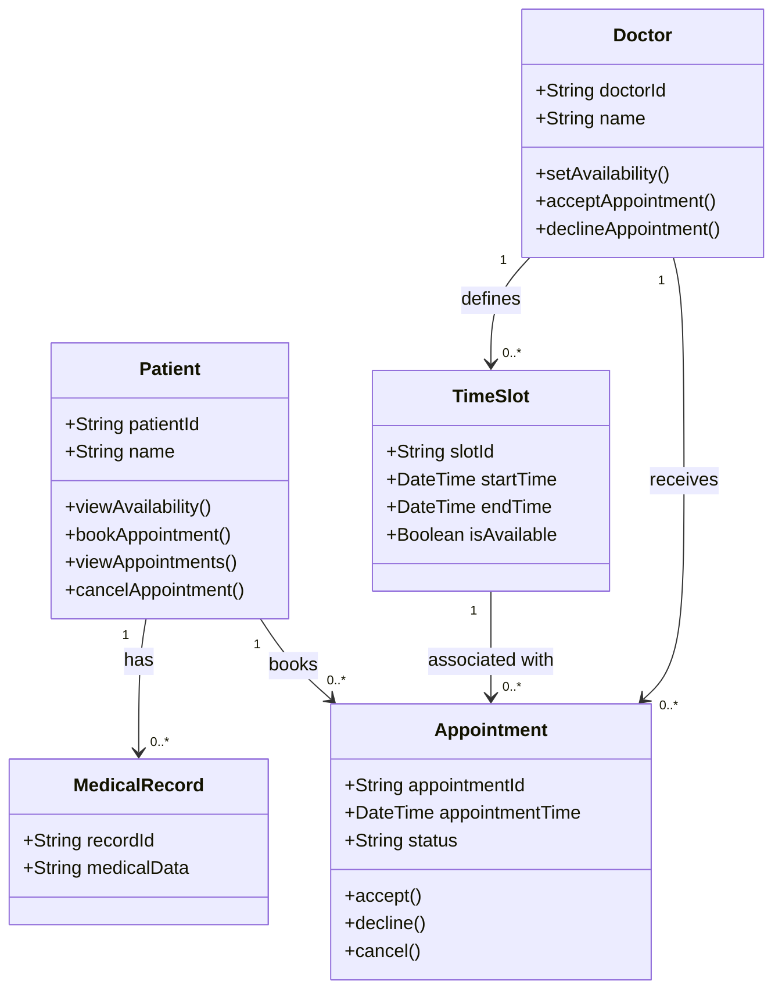

# Class Diagram

```mermaid
classDiagram
    class Patient {
        +String patientId
        +String name
        +viewAvailability()
        +bookAppointment()
        +viewAppointments()
        +cancelAppointment()
    }

    class Doctor {
        +String doctorId
        +String name
        +setAvailability()
        +acceptAppointment()
        +declineAppointment()
    }

    class Appointment {
        +String appointmentId
        +DateTime appointmentTime
        +String status
        +accept()
        +decline()
        +cancel()
    }

    class TimeSlot {
        +String slotId
        +DateTime startTime
        +DateTime endTime
        +Boolean isAvailable
    }

    class MedicalRecord {
        +String recordId
        +String medicalData
    }

    Patient "1" --> "0..*" Appointment : books
    Doctor "1" --> "0..*" Appointment : receives
    Doctor "1" --> "0..*" TimeSlot : defines
    TimeSlot "1" --> "0..*" Appointment : associated with
    Patient "1" --> "0..*" MedicalRecord : has
```
