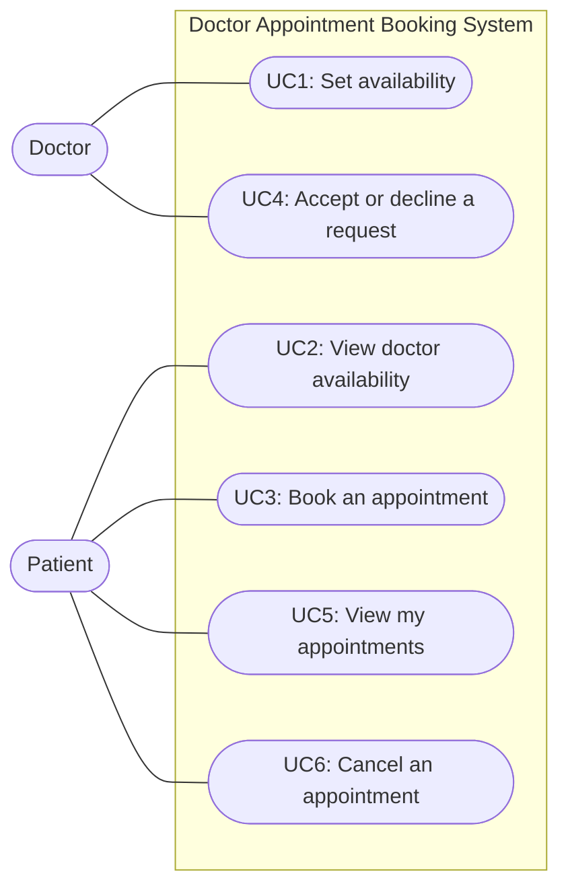

# Use Case Diagram

```mermaid
flowchart LR
    Patient([Patient])
    Doctor([Doctor])

    subgraph System["Doctor Appointment Booking System"]
        UC1(["UC1: Set availability"])
        UC2(["UC2: View doctor availability"])
        UC3(["UC3: Book an appointment"])
        UC4(["UC4: Accept or decline a request"])
        UC5(["UC5: View my appointments"])
        UC6(["UC6: Cancel an appointment"])
    end

    Doctor --- UC1
    Doctor --- UC4

    Patient --- UC2
    Patient --- UC3
    Patient --- UC5
    Patient --- UC6

```

